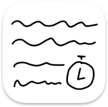

# Subbie

Quick and dirty native macOS clone of DivXLand Media Subtitler.

## Features

Currently supported features:

- available in FR and EN
- importing a text file
- reading existing SRT
- saving to SRT
- opening an associated video
- add/edit/move/remove a line
- update a line's timings when using an associated video
- remove gaps by matching a line's end time to the next line's start time
- undo/redo
- showing the subtitle preview while playing the associated video
- select a playback speed for the associated video
- delay all lines using a fixed offset
- view audio waveform
- move in time by clicking/dragging in the waveform

Planned features, if time permits:

- allow manually editing the timings as text

## Demo

https://github.com/dvkch/Subbie/assets/1838148/65a271d0-7d16-40b2-aba6-3a3461f9d89c

## Disclaimer

I made this project in a weekend to help a friend, I cannnot and will not guarantee I will have any more time to spend on it now that it reached v1.0. 

You may open an issue for improvments, but keep in mind this is meant as a small tool to quickly create and sync SRT files and I would like to keep the list of features as small as possible.

Of course, feel free to report any bugs, with a reproducible example if possible, and I'll do my best to link into it.

## License

MIT, I guess?
